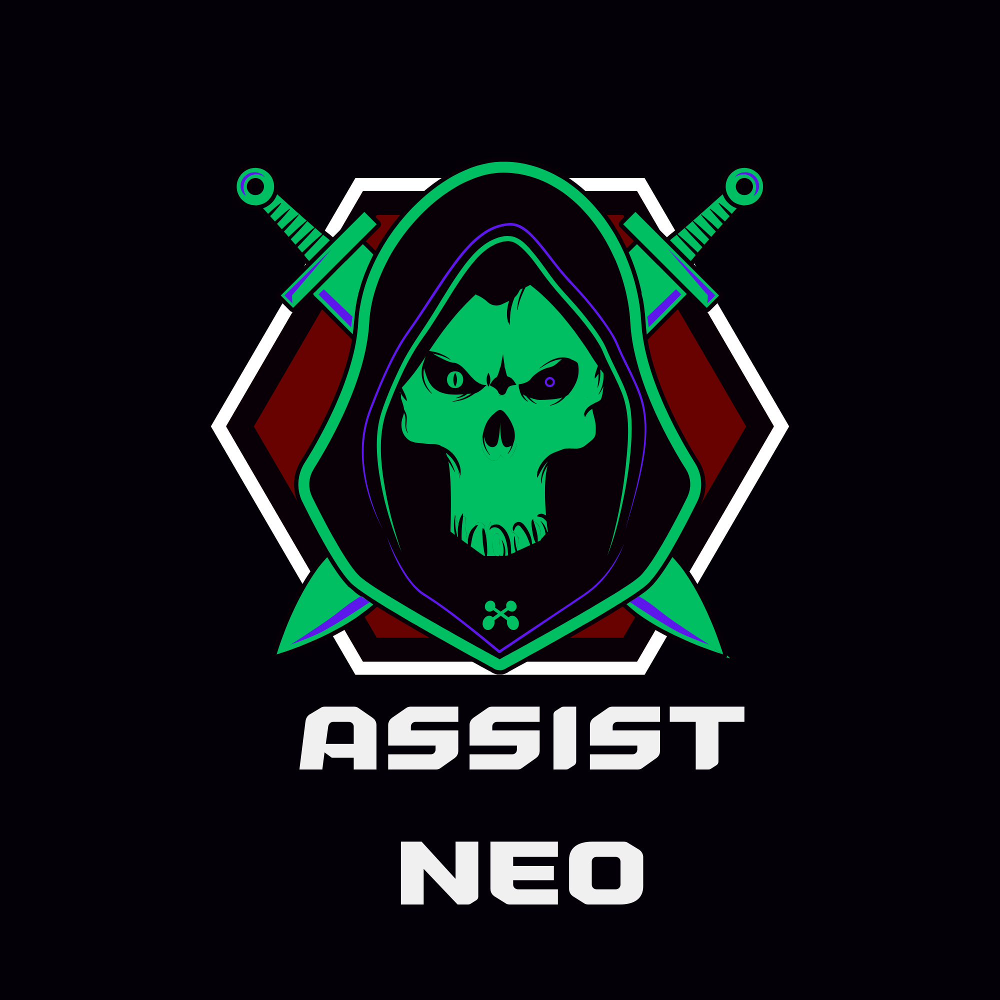

<div align="center">



# ✦ ASSIST NEO

**The Personal AI Assistant from the Future**

[](https://github.com)
[](https://python.org)
[](https://flask.palletsprojects.com)
[](https://github.com)

> *"The Future Is Not Coming. We Are Building It."*
> — Yuvan Industries

</div>

---

## ✨ What is Assist Neo?

**Assist Neo** is a full-featured personal AI assistant that runs in your browser. It combines a smart agent loop, long-term memory, real-time streaming, image generation, a built-in code editor, file browser, Git integration, and a plugin tool system — all from a clean, modern web interface.

Built by **Yuvan Industries** — a forward-thinking technology company from the future.

---

## ⚡ Features

### 🤖 AI & Chat
| Feature | Description |
|---|---|
| 🧠 **Multi-Model Routing** | Auto-routes to GPT-4o (code), GPT-4o-mini (fast), or main model based on query type |
| 🔄 **ReAct Agent Loop** | Plan → Execute Tools → Stream Answer in one turn |
| 📡 **SSE Streaming** | Token-by-token streaming with animated typing dots |
| 🖼️ **Image Generation** | Creates images via Pollinations AI — no API key needed |
| 🗂️ **Chat History** | Full conversation history with sidebar browser; previous chats reload instantly |

### 🧩 Memory
| Feature | Description |
|---|---|
| 🗄️ **SQLite Memory** | All user data, chats, settings, and memories stored in `assistneo.db` |
| 🔍 **Vector Memory** | ChromaDB semantic search — retrieves relevant past conversations per query |
| 📝 **Personal Facts** | Remembers your name, notes, and preferences permanently |

### 🔧 Tools & Plugins
| Tool | What it does |
|---|---|
| 🌤️ **Weather** | Live weather for any city |
| 🧮 **Calculator** | Arithmetic and expression evaluation |
| 📰 **News** | Latest headlines on any topic |
| ⏰ **Reminders** | Set reminders by natural language |
| 📅 **Calendar** | Add and view calendar events |
| 📧 **Email** | Draft and send emails |
| 💻 **Code Runner** | Execute Python/JS/Bash in sandbox |
| 🔀 **Git** | Run Git commands from the UI |

Tools are auto-discovered from `tools/` — drop a `.py` file to add a new plugin.

### 💻 Coding Panel
| Tab | Feature |
|---|---|
| ✏️ **Editor** | CodeMirror 5 editor with syntax highlighting, multi-language support, run & save |
| 📁 **Files** | Full project file browser — navigate, open, edit, create files & folders |
| 🔀 **Git** | Run any Git command and see output inline |
| 🐛 **Debugger** | Paste broken code → AI explains what's wrong and how to fix it |

### 🔒 Security & Multi-User
| Feature | Description |
|---|---|
| 👤 **Multi-User Login** | Per-user sessions, memory, and settings |
| 🔑 **Session Auth** | Flask session-based authentication |
| 🛡️ **Safe Paths** | File browser sandboxed to project workspace |

---

## 🧠 Architecture

```
User Message
     │
     ▼
┌─────────────────────────────────────────────────────────┐
│                    Assist Neo Agent                     │
│                                                         │
│  Phase 1 — Plan                                         │
│    LLM sees tools schema → decides if tools needed      │
│                                                         │
│  Phase 2 — Execute (up to 4 rounds)                     │
│    weather / calculator / news / reminders / calendar   │
│    → results injected back into context                 │
│                                                         │
│  Phase 3 — Stream Answer                               │
│    Final LLM call streams token-by-token via SSE       │
└─────────────────────────────────────────────────────────┘
     │
     ▼
┌─────────────────────────────────────────────────────────┐
│                     Memory System                       │
│                                                         │
│  SQLite (assistneo.db)   ←→   ChromaDB (vector store)  │
│  • chats                       • semantic retrieval     │
│  • memories / facts            • relevant past convos   │
│  • settings / users                                     │
└─────────────────────────────────────────────────────────┘
```

---

## 📦 Installation

### 1. Clone the Repository

```bash
git clone https://github.com/YOUR_USERNAME/AssistNeo.git
cd AssistNeo
```

### 2. Install Dependencies

```bash
pip install flask python-dotenv requests chromadb ddgs plyer
```

### 3. Create a `.env` File

```env
GITHUB_TOKEN=your_github_token_here
GEMINI_API_KEY=your_gemini_api_key_here

# Optional model overrides
MAIN_MODEL=gpt-4o-mini
CODE_MODEL=gpt-4o
FAST_MODEL=gpt-4o-mini
```

| Key | Where to get it |
|---|---|
| `GITHUB_TOKEN` | [github.com/settings/tokens](https://github.com/settings/tokens) → Models permission |
| `GEMINI_API_KEY` | [aistudio.google.com](https://aistudio.google.com) → Get API Key |

### 4. Run

```bash
python smith_web.py
```

Open your browser at `http://localhost:5000` and log in. 🎉

---

## 🗂️ Project Structure

```
AssistNeo/
│
├── smith_web.py            # Flask app, all routes, Blueprint registration
├── assistant.py            # AI calls, image gen, memory helpers
├── agent.py                # ReAct agent loop (Plan → Execute → Stream)
│
├── routes/
│   ├── __init__.py
│   └── stream_routes.py    # SSE /stream Blueprint
│
├── tools/
│   ├── __init__.py         # Tool registry, OpenAI schema builder
│   ├── weather.py
│   ├── calculator.py
│   ├── news.py
│   ├── reminders.py
│   ├── calendar.py
│   ├── email.py
│   ├── code_runner.py
│   └── git.py
│
├── templates/
│   └── index.html          # Full UI (chat, sidebar, coding panel)
│
├── vector_memory.py        # ChromaDB semantic memory
├── assistneo.db            # SQLite: chats, users, memories, settings
├── uploads/                # Images and file uploads
├── .env                    # API keys (keep private!)
└── requirements.txt
```

---

## 🛣️ Roadmap

- [x] Multi-Model Routing (GPT-4o / GPT-4o-mini / Gemini)
- [x] ReAct Agent with Tool Calling
- [x] SSE Token Streaming
- [x] SQLite Memory (chats, users, facts)
- [x] Vector Memory (ChromaDB semantic search)
- [x] Image Generation (Pollinations AI)
- [x] Plugin Tool System (auto-discovery)
- [x] Coding Panel (editor, file browser, git, debugger)
- [x] Multi-User Login & Sessions
- [ ] Internet Features (live web search, deep research, YouTube)
- [ ] Document Features (PDF/DOCX/PPT generation, OCR)
- [ ] Vision (image understanding, screenshot analysis)
- [ ] Browser Automation
- [ ] Voice Mode
- [ ] Mobile PWA
- [ ] Multi-Agent System

---

## 🔒 Security Notes

- Never share your `.env` file
- Use a GitHub Fine-Grained Token (Models permission only)
- All chat data is stored locally in `assistneo.db`
- File browser is sandboxed to the project workspace directory

---

## 🧪 Testing Features

| Feature | How to test |
|---|---|
| Streaming | Send any message → watch dots → text streams in |
| Image Gen | `create an image of a sunset` |
| Weather tool | `what's the weather in Tokyo` |
| Calculator | `what is 847 × 293` |
| Code panel | Click `💻 Code & Files` in sidebar |
| File browser | Code panel → Files tab |
| Previous chats | Click any chat in the sidebar |

---

<div align="center">

## 👨‍💻 Created By

<br/>

### ✦ YUVAN INDUSTRIES ✦

**A Future Technology Company**

*Building the intelligent systems of tomorrow — today.*

<br/>

| Focus Area | |
|---|---|
| 🤖 Artificial Intelligence | 🦾 Robotics |
| 🧬 Autonomous Systems | 💡 Smart Software |
| 🌐 Intelligent Platforms | 🔭 Future Technologies |

<br/>

> *Yuvan Industries is on a mission to build AI that feels human,*
> *software that thinks ahead, and technology that changes lives.*

<br/>

📧 **Contact:** [shakthiyuvan01@gmail.com](mailto:shakthiyuvan01@gmail.com)

<br/>

⭐ **If you find Assist Neo useful, give it a star.**

<br/>

---

*© 2026 Yuvan Industries. All rights reserved.*

</div>
